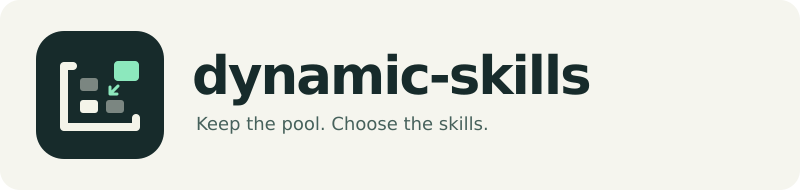
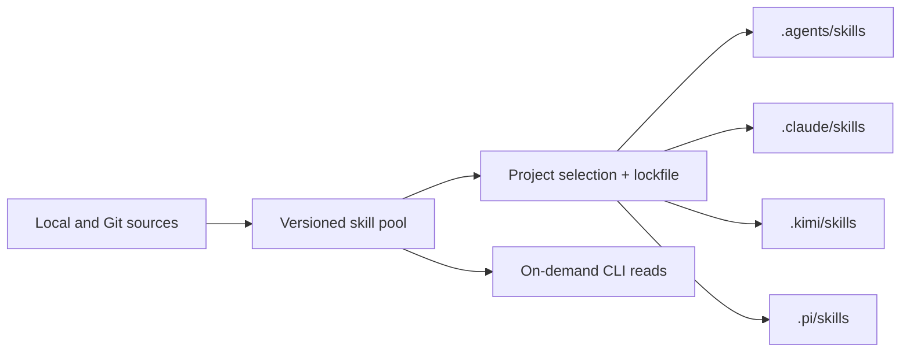

<p align="center">
  
</p>
<p align="center">
  <a href="https://github.com/M1racleShih/dynamic-skills/actions/workflows/ci.yml"></a>
  
  <a href="LICENSE"></a>
</p>

**A versioned skill pool. Just the skills your project needs.**

Collecting skills is easy. Keeping every agent's skill list useful takes more care.
Dynamic Skills stores your library outside native discovery directories, then
activates a small, explicit selection in each project. Change that selection as
the work changes, without losing the skills you collected.

Built for **Codex, Claude Code, Kimi Code and Pi**. Local first, CLI first, no server,
account, background daemon, telemetry or model subscription required.

> **v0.1 · Alpha.** Core workflows have automated filesystem and CLI tests.
> Native loading depends on your agent version, trust settings and configuration.
> This tool does not erase instructions already present in an ongoing conversation.

## Install

Requires Python 3.11+. Git is required for Git repository sources.

```sh
uv tool install git+https://github.com/M1racleShih/dynamic-skills.git
```

Or use pipx:

```sh
pipx install git+https://github.com/M1racleShih/dynamic-skills.git
```

Both `dskills` and `dynamic-skills` invoke the same CLI. The package has not yet
been published to PyPI; install from this repository or a locally built wheel.

## Get started

From your project directory:

```sh
# Import one skill, including its scripts, references and assets.
dskills install /path/to/my-skill --tag engineering

# Choose the agents used in this project. Repeat --agent as needed.
dskills init --agent codex --agent claude --agent kimi --agent pi

# Review the filesystem changes, then activate the skill by its pool ID.
dskills plug my-skill --dry-run
dskills plug my-skill

dskills status
```

Without `--agent`, `init` detects agent configuration directories in your project
or user home. If it finds none, it asks you to specify an agent. Explicit flags
make the choice predictable. `--project /path/to/project` works with project
commands; commands in subdirectories find the nearest manifest within the Git
boundary. An uninitialized directory stays the selected initialization target.

Install a skill from a Git repository:

```sh
dskills install https://github.com/openai/skills.git \
  --skill skills/.curated/gh-fix-ci --tag github

# Optional: follow a particular branch or tag.
dskills install https://github.com/owner/repository.git \
  --skill skills/my-skill --ref main
```

Use a repository URL, not a GitHub `/tree/` page. A repository containing several
skills requires `--skill` to select one. HTTPS and SSH are supported. Authentication
can use your SSH agent and SSH configuration. Use SSH for private repositories;
embedded URL passwords, Git hooks, submodules and skill installation scripts are
not used. Custom global Git configuration, including credential helpers, is
deliberately not loaded.

## One pool, an explicit project selection



- **Keep versions separate from activation.** Pool updates never silently advance
  another project's pinned skill.
- **Make changes reversible.** Preview insertion/removal, undo project changes,
  roll back pool versions, and restore migrated globals.
- **Preserve local work.** Existing unmanaged directories and edited managed copies
  block replacement. All outputs are checked before project writes begin.
- **Give agents a small interface.** Search locally, read one skill, or change
  project selection through a versioned JSON response format.
- **Measure what is observable.** Count local CLI operations, including reads,
  without pretending those counts measure actual agent execution.

## Clean up global skills

Start with an inventory:

```sh
dskills scan
dskills migrate --disable                 # Preview only
dskills migrate --apply                   # Import; leave globals active
dskills migrate --apply --disable         # Import, back up, deactivate originals
```

To migrate only a particular collection:

```sh
dskills migrate --from ~/.claude/skills --disable
dskills migrate --from ~/.claude/skills --disable --apply
```

`--from` is repeatable. `--user-home` changes the home directory used for discovery;
it does not change where the pool is stored. Scanning reports candidate roots,
not an exact reconstruction of each running agent's configured catalog.

The scanner understands nested `SKILL.md` directories, standalone Markdown skills,
and skill-directory symlinks. Skills must have valid YAML `name` and `description`.
System directories, recognizable plugin locations, synced Claude skills and links
into this pool are skipped. Linked grouping directories are reported for explicit
handling rather than traversed automatically. Custom package locations may need
manual classification; there is no claim to detect every plugin manager.

Identical names with different content receive deterministic pool aliases. An
alias changes the pool ID, **not** the skill's declared native name. Only one skill
with a given native name can be selected in a project.

Deactivation moves original entries into the pool's backup area; it does not delete
their content. For a symlink, the original link is moved and its target stays put.
Moves require the source and pool to be on the **same filesystem**. Otherwise,
choose a pool on that filesystem with `--home`, or import without deactivation.

```sh
dskills migrations
dskills migrate-restore <migration-id>
```

Restore refuses to overwrite a newly created global entry. An interrupted migration
is listed as `preparing` and can also be recovered with `migrate-restore`. Pool
imports are retained when a migration is restored. Importing without deactivation
does not reduce global discovery. Plugin and system skills remain controlled by
their owning tools.

Migrated local skills are snapshots. If their original source directory was moved,
`update` cannot poll that path until it is restored. Import a Git source when you
want ongoing upstream updates; preserve the backups for local originals.

## Change skills as the project evolves

```sh
dskills search "code review" --limit 5
dskills list --tag engineering
dskills tag my-skill backend
dskills tag my-skill engineering --remove

dskills unplug my-skill --dry-run
dskills unplug my-skill
dskills undo
```

Pool versions and project selection have separate histories:

```sh
dskills update my-skill --dry-run          # Check upstream; don't change the pool
dskills update my-skill                    # Store a new pool version
dskills info my-skill                      # Show versions and provenance

dskills plug my-skill                      # Explicitly advance this project's pin
dskills plug my-skill --revision <hash>     # Or choose a retained version
dskills undo                              # Undo that project change

dskills rollback my-skill                  # Change only the pool default
dskills rollback my-skill --revision <hash>
```

Hashes may be full SHA-256 values or unambiguous prefixes. Versions retain the
complete skill tree and executable flags. Imports reject embedded symlinks and
special files, and cap each skill at 128 MiB / 16,384 files. Generated directories
such as `.git`, `.venv`, `node_modules` and `__pycache__` are excluded on import.
Any files later added inside a managed output count as local changes.

## Reproduce a project's setup

Project metadata lives in `.dynamic-skills/`:

```text
.dynamic-skills/
  .gitignore       # Generated from the track setting
  config.json      # Agents, mode, skill selection and track (default false)
  lock.json        # Exact hashes and source provenance
  state.json       # Local output ownership
  project.lock     # Local process lock
  history/         # Local undo snapshots
  transaction/     # Interrupted transaction recovery
```

By default the internal `.gitignore` contains `*`, ignoring all of this directory,
including itself. dskills does not create or edit the project's root `.gitignore`.
To allow sharing configuration:

```sh
dskills init --agent codex --track  # New project
# Or, for an initialized project:
dskills config --track
git add .dynamic-skills/
```

Only `config.json`, `lock.json`, and the internal `.gitignore` become available
for tracking. State, history, process locks and transactions always remain ignored.
`dskills config --no-track` restores the default. These commands never stage files
or remove them from Git's index. Already tracked files require `git rm --cached`
to stop tracking. Existing parent/global ignore rules or local exclusions for
`.dynamic-skills/` can still block tracking; remove those rules yourself or use
`git add -f` for the three shared files. dskills leaves existing rules untouched.

Legacy root `dynamic-skills.json` and `dynamic-skills.lock.json` are still readable.
The next successful `sync` or other project write moves them into the new layout
in a recoverable transaction. Read-only commands and dry runs do not migrate them.
Conflicting old and new metadata are rejected instead of silently overwriting data.

Generated skills outside `.dynamic-skills/` still use Git's local `info/exclude`
(normally `.git/info/exclude`), with support for worktrees and nested projects.
Non-Git projects need no external exclude rules.

Then, after cloning:

```sh
dskills sync
dskills doctor
```

`sync` restores pinned content and reconstructs generated outputs. It never
resolves a floating Git branch to replace the commit in your lockfile. Git sources
must still expose the pinned commit. Local sources record an absolute path and
are portable only when that source is available with identical content, or when
the required pool objects have been copied to the new machine. Filesystems must
preserve the recorded file contents and executable flags; differences fail integrity
checks, including executable-bit differences across operating systems. Review source paths
before publishing a lockfile. Built-in bridge pins can be restored from a matching
Dynamic Skills package version.

The pool lives in the platform's user data directory: usually
`~/.local/share/dynamic-skills` on Linux, `~/Library/Application Support/dynamic-skills`
on macOS, and `%LOCALAPPDATA%\dynamic-skills` on Windows. Set
`DYNAMIC_SKILLS_HOME` or pass the global `--home` option to override it.

Project ownership, undo history and interrupted-write journals live in
`.dynamic-skills/`. Optionally share the manifest and lockfile; keep this local state out of
Git. Generated ignore rules are narrowly scoped to each managed skill and are
retained after removal, so reactivation remains ignored.

The default distribution mode is **copy**, protecting pool content from accidental
edits through the project. `init --mode symlink` is available when your filesystem
supports directory links; Windows may require Developer Mode or link privileges.
Changing `mode` or `agents` in the manifest followed by `sync` reconciles the outputs.
Use `plug` and `unplug` to change selected skills and their lockfile entries together.

## Organize the pool with categories

Categories reuse skill tags: a skill can belong to both `frontend` and `testing`.
Inspect categories and find skills that still need organizing:

```sh
dskills category list
dskills list --tag frontend
dskills list --untagged
dskills search "testing" --untagged
dskills category add frontend react-skill css-skill
dskills category remove frontend css-skill
```

Replace the example skill IDs with IDs from `dskills list`. Batch category changes
validate every ID before saving; an unknown ID leaves the entire batch unchanged.
The existing `tag <skill-id> <tag>...` command still manages several tags on one
skill. Categories change only pool metadata, never skill content or project copies.
Counts include a skill in each of its tags; untagged skills are counted separately.
`--tag` and `--untagged` are mutually exclusive. Classification is explicit, not
automatically inferred from skill names or descriptions.

## Reusable skill packages

Packages are user-defined, local lists of **pool skill IDs**, not copies of skills
or pinned project configurations. Compose one by hand, or capture the skills
currently in a category:

```sh
dskills package create frontend react-skill css-skill --description "Frontend tools"
dskills package create backend --from-tag backend
dskills package list
dskills package show frontend
dskills package add frontend accessibility-skill
dskills package remove frontend css-skill
```

`--from-tag` is repeatable. Its matches and any explicit IDs are combined and
deduplicated. This is a **one-time membership snapshot**: changing tags later does
not change an existing package. Packages must contain at least one existing pool
skill; unknown IDs, tags with no matches, duplicate package names and edits that
would empty a package are rejected without partial changes. Package names use the
same lowercase-letter, digit and hyphen rules as skill IDs.

In any project initialized with `dskills init`, apply one or more packages:

```sh
dskills package apply frontend backend --dry-run
dskills package apply frontend backend
dskills undo
```

Use `--project /path/to/project` to target another initialized project. Application
expands the packages into individual skills and commits **one undoable project
transaction**, not a sequence of independent installations:

- Missing members are pinned to the pool's current versions at application time.
- Already selected members keep their exact project pins, even if the pool has
  newer versions. Use the existing `plug <skill-id>...` command to explicitly
  advance them.
- Other selected skills, agents, distribution mode and tracking settings stay
  unchanged. Overlapping package members are handled once.
- Existing conflict protection, dry-run limitations and transaction recovery
  apply. Repeating an application with unchanged outputs creates no new undo entry.

The project still stores individual skill IDs and pins, not a live subscription
to a package. Editing or deleting a package never changes projects that used it;
use `unplug` to remove individual project skills. `dskills package delete frontend`
deletes only that package definition and leaves all pool skills intact.

Definitions live in the selected pool and follow `--home` / `DYNAMIC_SKILLS_HOME`.
There are no built-in frontend/backend member lists, nested packages or package
sharing files; build combinations from the skills already in your own pool.

## Reusable presets

```sh
dskills preset save backend
dskills preset list
dskills preset apply backend --dry-run
dskills preset apply backend
dskills undo
```

Presets are local, version-pinned snapshots of the selection, agents and mode.
Applying one **replaces** the current project configuration. `preset remove` deletes
only the saved preset. It does not alter projects that previously used it.

Use **categories** to organize and discover skills, **packages** to add a reusable
combination while preserving existing pins, and **presets** to replace a project
configuration with an exact saved setup. Package and preset names are independent.

## An interface your agent can drive

All command options appear in `dskills --help` and `dskills <command> --help`.
Put global options before the command:

```sh
dskills --json search "testing" --limit 5
dskills --json read my-skill --project .
dskills --json plug my-skill --dry-run
```

Success:

```json
{"schema_version":1,"ok":true,"data":{"id":"my-skill","digest":"…","path":"…","content":"…"}}
```

Failure:

```json
{"schema_version":1,"ok":false,"error":{"code":"not_found","message":"Unknown skill: missing. Use dskills list or install."}}
```

Exit codes: `0` for success, `1` for operation/health failures, `2` for CLI usage
errors. JSON output contains no ANSI decoration. `--help` and `--version` remain
human-readable. `--dry-run` previews outputs and conflicts without altering project
selection or importing snapshots; upstream update/install previews may fetch into
a temporary directory. A project preview does not guarantee a missing source can
be fetched during the actual operation. Pool/lock directories may be initialized.

To expose just one small skill that teaches your agent this interface:

```sh
dskills bridge
```

The optional `dynamic-skills` skill can search the pool and read instructions on
demand, without activating every candidate. Remove it with
`dskills unplug dynamic-skills`. It is also included in the source distribution at
`src/dynamic_skills/bundled/dynamic-skills/SKILL.md`.

`read --project .` follows the project's pin. `read` without a project follows the
pool default. Both return a resource path for relative references and count a CLI
read. Treat pool objects as read-only. If a skill needs to write into its own
resources, activate a project copy and work there. No skill scripts run merely
because you install, activate or read a skill.

## Agent compatibility and session refresh

| Agent | Generated project directory | Refresh guidance |
| --- | --- | --- |
| [Codex](https://developers.openai.com/codex/skills) | `.agents/skills/` | Automatic discovery; restart if a change is missing. |
| [Claude Code](https://code.claude.com/docs/en/skills) | `.claude/skills/` | Live change detection; restart if a change is missing. |
| [Kimi Code](https://github.com/MoonshotAI/kimi-cli/blob/main/docs/en/customization/skills.md) | `.kimi/skills/` | Restart for a refreshed skill catalog. |
| [Pi](https://github.com/badlogic/pi-mono/blob/main/packages/coding-agent/docs/skills.md) | `.pi/skills/` | Trust the project, then use `/reload`. |

Discovery is **not isolated by target agent**. Pi and Kimi can also read
`.agents/skills`; Kimi can merge other branded skill directories. Existing globals,
ancestor directories, packages, custom loader settings and disabled-skill policies
can affect what is visible. Native skill extensions are preserved, not translated;
a Claude-specific skill is not automatically semantically portable to another agent.

These paths and refresh notes follow upstream documentation reviewed on
2026-09-10. Filesystem contracts are tested for all four adapters. End-to-end model
selection, every runtime release and every custom configuration are not guaranteed.
Removing a directory cannot erase instructions already read into a conversation.

## Diagnostics, recovery and statistics

```sh
dskills status                 # Report selection, missing outputs and local edits
dskills doctor                 # Check all catalog versions and current project health
dskills recover                # Roll back an interrupted project transaction
dskills stats
dskills stats --events
```

Project writes use a process lock, staged replacements and a journal. Ordinary
failures roll back; process interruption leaves a journal for explicit recovery.
Recovery preserves unexpected new edits and asks you to move them aside. This is
not a guarantee against disk failure, concurrent edits by unrelated processes or
malicious local users. Keep your normal backups.

Counts describe **local CLI operations**, including install, update, read and
selection changes. They do not measure native filesystem reads, actual execution,
model usefulness or token savings. Totals are retained; the event view retains the
most recent 500 operations, including project paths. No data is uploaded.

## Development

```sh
git clone https://github.com/M1racleShih/dynamic-skills.git
cd dynamic-skills
uv sync --group dev
uv run pytest
uv run ruff check src tests
uv run ruff format --check src tests
uv build
```

Tests use disposable directories and offline Git fixtures, never your real skills
or a production agent session. CI exercises Linux, macOS and Windows with Python
3.11 and 3.13. Development specifications and work logs are maintained separately
from this repository. Product documentation belongs here.

Contributions should include a focused behavior change and relevant regression
coverage. Future directions include additional adapters, reliable opt-in runtime
usage hooks, portable pool bundles and richer project recommendations.

## Related tools

[Skills Manager](https://github.com/xingkongliang/skills-manager),
[Skillshare](https://github.com/runkids/skillshare),
[Vercel Skills](https://github.com/vercel-labs/skills),
[OpenSkills](https://github.com/numman-ali/openskills) and
[Skills-ContextManager](https://github.com/One-Man-Company/Skills-ContextManager)
are useful projects in this space. Dynamic Skills focuses on explicit project
selection, reproducible versions and reversible migration of an existing library.
Choose based on your workflow; GUI, synchronization and MCP loading solve related
but different needs.

## License

[MIT](LICENSE). Imported skills retain their original licenses and provenance.
