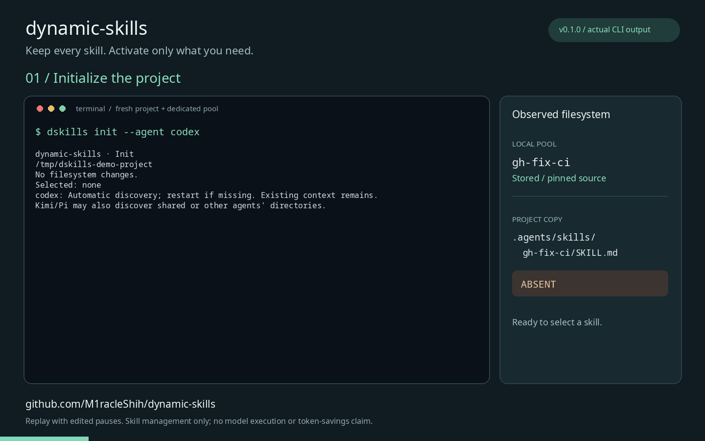

<p align="center">
  
</p>

[English](README.md) | 简体中文

# 收藏所有 Skills，每个项目只启用需要的几个

Skills 越积越多，但代码审查、前端开发、文档写作往往需要不同的组合。
**Dynamic Skills（`dskills`）把技能收藏和项目使用分开管理：本地保留版本化技能池，各项目选择并锁定自己需要的技能。**

- **按项目启用：** 从共享池向项目的原生技能目录生成副本，支持 Codex、Claude Code、Kimi Code 和 Pi。
- **锁定版本：** 更新池里的技能，不会自动更新其他项目已锁定的版本。
- **可预览、可撤销：** 启用和移除前查看变更，操作后可撤销；已有本地修改会受到冲突保护。
- **本地运行：** CLI 无需服务器、账号、后台进程或模型订阅，不上传使用数据。Agent 本身的使用条件另计。



演示长 40 秒，基于 `dskills 0.1.0` 的实际输出，缩短了等待时间。
演示展示目录和版本管理，不代表 Agent 已执行技能。[复现说明](docs/demo.md)。

> 当前为 **v0.1.0 Alpha**。原生技能的发现和刷新取决于 Agent 版本、配置与信任设置。
> 移除技能不会清除已经进入当前对话的指令；项目不声称测量或保证 token 节省。

## 安装

需要 Python 3.11+；从 Git 仓库导入还需要 Git。

```sh
uv tool install dynamic-skills==0.1.0
```

也可以使用 `pipx install dynamic-skills==0.1.0`。`dskills` 和 `dynamic-skills` 是同一个 CLI 的两个入口。
升级前请阅读 [更新记录](CHANGELOG.md)，Alpha 版本间升级建议保留池和项目元数据备份。

## 在空目录里体验一次完整流程

以下示例使用独立的演示池，导入固定提交上的公开技能，不需要你事先准备技能文件。
需要能访问 GitHub；导入公开源不要求登录 GitHub。命令适用于 macOS/Linux shell。
PowerShell 中请将 `export` 一行替换为 `$env:DYNAMIC_SKILLS_HOME = "$PWD/.demo-pool"`。

```sh
mkdir dskills-quickstart
cd dskills-quickstart
export DYNAMIC_SKILLS_HOME="$PWD/.demo-pool"

dskills install https://github.com/openai/skills.git \
  --skill skills/.curated/gh-fix-ci \
  --ref 49f948faa9258a0c61caceaf225e179651397431

dskills init --agent codex
dskills plug gh-fix-ci --dry-run
dskills plug gh-fix-ci
dskills status

dskills unplug gh-fix-ci
dskills undo
dskills doctor
```

观察 `.agents/skills/gh-fix-ci/SKILL.md`：启用后出现，移除后消失，撤销后恢复。
移除项目副本不会删除池中的版本。如需启用内置的 `dynamic-skills` 管理技能，请再运行 `dskills bridge`。

使用 Claude Code 时，将初始化参数改为 `--agent claude`，对应目录为 `.claude/skills/`。
也可选择 `kimi` 或 `pi`，或重复 `--agent` 为同一项目配置多个 Agent。

这个例子只验证技能管理，不会执行技能、读取真实 PR 或修改远程仓库。
实际使用 `gh-fix-ci` 修复 CI 时，仍需要它自己的工具和认证条件。让 Agent 使用前应先阅读技能说明。
体验结束后关闭此 shell，或执行 `unset DYNAMIC_SKILLS_HOME`；PowerShell 使用
`Remove-Item Env:DYNAMIC_SKILLS_HOME`。演示文件仍保留在这个目录中。

## 让 Agent 帮你管理

内置的 `dynamic-skills` 技能教 Agent 搜索本地池、按需读取技能和管理项目选择。
请先初始化项目，然后运行 `dskills bridge` 启用它。
它不附带专业技能合集，需要先导入你希望使用的技能。

可以对 Agent 说：

```text
使用 dynamic-skills 技能，查看当前项目已经启用的技能，
建议哪些可以移除，并预览变更。等我确认后再应用，保留池中的版本，并说明如何撤销。
```

Agent 需要能够运行已安装的 `dskills`，并获得执行对应操作的权限。
如果技能未出现，请按所用 Agent 的方式刷新或重启。

## 常用操作

```sh
dskills install /path/to/my-skill --tag engineering
dskills search "code review" --limit 5
dskills list --tag engineering
dskills plug my-skill --dry-run
dskills plug my-skill
dskills unplug my-skill
dskills undo
```

上面的本地路径和 `my-skill` 是占位示例，请替换为你的文件路径和池内技能 ID。

| 需求 | 对应能力 |
| --- | --- |
| 给技能分类 | 标签 / categories；同一技能可属于多个分类 |
| 向项目增加一组技能 | packages；保留已有项目的锁定版本 |
| 替换整套项目配置 | presets；保存选择、版本、Agent 和分发模式 |
| 检查更新 | `dskills update <id> --dry-run` |
| 检查当前项目 | `dskills status`、`dskills doctor` |
| 恢复中断的写入 | `dskills recover` |
| 供 Agent 或脚本读取 | `dskills --json ...` |

## 迁移已有全局技能

先查看清单和预览：

```sh
dskills scan
dskills migrate --disable
```

`dskills migrate --apply` 导入但保留原位置；`dskills migrate --apply --disable`
会备份并停用原位置。备份移动要求源与池在同一文件系统。恢复可用
`dskills migrations` 查看记录，再运行 `dskills migrate-restore <migration-id>`。
插件和系统技能仍由所属工具管理；扫描不保证覆盖所有自定义目录。
迁移本地源是快照，原路径被移走后，更新无法继续从该路径拉取内容。

## 版本、共享与边界

项目配置和锁文件放在 `.dynamic-skills/`，默认不纳入 Git。
需要共享时使用 `dskills config --track`；新项目可使用 `dskills init --agent codex --track`。
在其他机器上运行 `dskills sync` 恢复锁定内容，Git 源需仍能提供锁定提交。
本地源记录绝对路径，不能保证跨机器可用；发布锁文件前应检查路径。

默认使用副本，避免项目内编辑污染池内容；符号链接模式需要对应的文件系统支持。
来自不同 Agent 的专用技能不会自动转换语义。全局目录、父目录和插件也可能影响实际可见技能。

完整命令、兼容性说明和恢复限制见 [英文参考文档](README.md)。

## 反馈和贡献

欢迎通过 [Issues](https://github.com/M1racleShih/dynamic-skills/issues) 提供使用场景和可复现问题。
反馈时可附操作系统、Python / dskills / Agent 版本、执行步骤、预期和实际结果；请移除私密路径与凭据。
开发和测试方法见 [Development](README.md#development)。

[MIT 许可证](LICENSE)。导入的技能保留各自原有许可证和来源。
